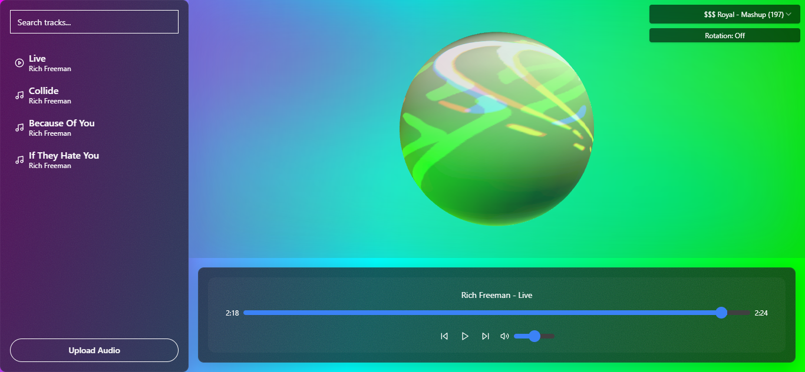
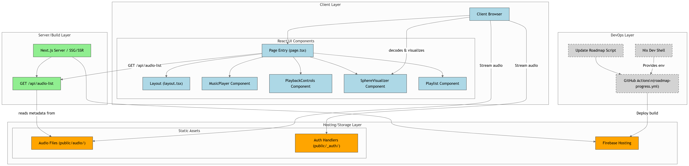

# AudioSphere

AudioSphere is a web-based music player featuring audio visualization, playlist management, and dynamic track loading. It's built with Next.js, Tone.js for audio processing, and is deployed on Vercel.

## Preview



## Architecture Diagram

```mermaid
graph TB
    %% Client Layer
    subgraph "Client Layer"
        direction TB
        Browser["Client Browser"]:::frontend
        subgraph "React UI Components"
            direction TB
            PageEntry["Page Entry (page.tsx)"]:::frontend
            LayoutComp["Layout (layout.tsx)"]:::frontend
            MusicPlayer["MusicPlayer Component"]:::frontend
            PlaybackControls["PlaybackControls Component"]:::frontend
            SphereVisualizer["SphereVisualizer Component"]:::frontend
            Playlist["Playlist Component"]:::frontend
        end
    end

    %% Server/Build Layer
    subgraph "Server/Build Layer"
        direction TB
        NextServer["Next.js Server / SSG/SSR"]:::backend
        AudioAPI["GET /api/audio-list"]:::backend
    end

    %% Hosting/Storage Layer
    subgraph "Hosting/Storage Layer"
        direction TB
        FirebaseHost["Firebase Hosting"]:::storage
        subgraph "Static Assets"
            direction TB
            AudioAssets["Audio Files (public/audio/)"]:::storage
            AuthHandlers["Auth Handlers (public/_auth/)"]:::storage
        end
    end

    %% DevOps Layer
    subgraph "DevOps Layer"
        direction TB
        GitHubActions["GitHub Actions\n(roadmap-progress.yml)"]:::devops
        UpdateScript["Update Roadmap Script"]:::devops
        NixShell["Nix Dev Shell"]:::devops
    end

    %% Connections
    Browser --> PageEntry
    PageEntry --> LayoutComp
    PageEntry --> MusicPlayer
    PageEntry --> PlaybackControls
    PageEntry --> SphereVisualizer
    PageEntry --> Playlist

    PageEntry -->|"GET /api/audio-list"| AudioAPI
    AudioAPI -->|"reads metadata from"| AudioAssets

    Browser -->|"Stream audio"| AudioAssets
    Browser -->|"Stream audio"| AuthHandlers
    Browser -->|"decodes & visualizes"| SphereVisualizer

    NextServer --> AudioAPI
    NextServer --> FirebaseHost

    GitHubActions -->|"Deploy build"| FirebaseHost
    UpdateScript --> GitHubActions
    NixShell -->|"Provides env"| GitHubActions

    %% Click Events
    click LayoutComp "https://github.com/codedeficient/audiosphere/blob/main/src/app/layout.tsx"
    click PageEntry "https://github.com/codedeficient/audiosphere/blob/main/src/app/page.tsx"
    click MusicPlayer "https://github.com/codedeficient/audiosphere/blob/main/src/components/MusicPlayer.tsx"
    click PlaybackControls "https://github.com/codedeficient/audiosphere/blob/main/src/components/PlaybackControls.tsx"
    click SphereVisualizer "https://github.com/codedeficient/audiosphere/blob/main/src/components/SphereVisualizer.tsx"
    click Playlist "https://github.com/codedeficient/audiosphere/blob/main/src/components/Playlist.tsx"
    click AudioAPI "https://github.com/codedeficient/audiosphere/blob/main/src/app/api/audio-list/route.ts"
    click AudioAssets "https://github.com/codedeficient/audiosphere/tree/main/public/audio/"
    click AuthHandlers "https://github.com/codedeficient/audiosphere/tree/main/public/_auth/"
    click FirebaseHost "https://github.com/codedeficient/audiosphere/blob/main/firebase.json"
    click FirebaseHost "https://github.com/codedeficient/audiosphere/blob/main/.firebaserc"
    click GitHubActions "https://github.com/codedeficient/audiosphere/blob/main/.github/workflows/roadmap-progress.yml"
    click UpdateScript "https://github.com/codedeficient/audiosphere/blob/main/.github/scripts/update-roadmap-checkbox.js"
    click NixShell "https://github.com/codedeficient/audiosphere/blob/main/.idx/dev.nix"

    %% Styles
    classDef frontend fill:#ADD8E6,stroke:#333,stroke-width:1px
    classDef backend fill:#90EE90,stroke:#333,stroke-width:1px
    classDef storage fill:#FFA500,stroke:#333,stroke-width:1px,shape:cylinder
    classDef devops fill:#D3D3D3,stroke:#333,stroke-width:1px,stroke-dasharray: 5 5
```



<details>
<summary>View Mermaid Code for Diagram</summary>


</details>

## Project Overview

AudioSphere is built with Next.js and leverages modern web technologies to provide a unique audio visualization experience. Key features include:
*   Dynamic playlist management with metadata extraction.
*   Real-time audio spectrum visualization using Tone.js.
*   Playback controls for seamless user experience.
*   File upload and drag-and-drop support for local audio tracks.
*   Deployment on Vercel, with static audio assets served alongside the application.
*   Nix development environment for reproducible builds (via `.idx/dev.nix`).

## Getting Started

To run this project locally, follow these steps:

1.  **Clone the repository:**
    ```bash
    git clone https://github.com/CodeDeficient/AudioSphere.git
    cd AudioSphere
    ```
2.  **Install dependencies:**
    Make sure you have Node.js and npm (or yarn/pnpm) installed.
    ```bash
    npm install
    # or
    # yarn install
    # or
    # pnpm install
    ```
3.  **Set up environment variables (if any):**
    If your deployment or specific features require environment variables, create a `.env.local` file in the root directory and add them there. Refer to `.env.example` if one exists for guidance on required variables.

4.  **Run the development server:**
    ```bash
    npm run dev
    # or
    # yarn dev
    # or
    # pnpm dev
    ```
    The application should now be running on [http://localhost:3000](http://localhost:3000).

5.  **Using the Nix development shell (Optional but Recommended for consistency):**
    If you have Nix installed, you can enter a consistent development environment by running:
    ```bash
    nix develop .#
    # or if using experimental features without flakes enabled by default
    # nix-shell
    ```
    Inside the Nix shell, all dependencies specified in `.idx/dev.nix` will be available. You can then proceed with `npm install` and `npm run dev`.


## Usage

This project is publicly visible for demonstration and portfolio purposes. The source code is not available for reuse, modification, or distribution without explicit prior permission from the author. All rights are reserved.

---

_This README was updated from a Firebase Studio Next.js starter template._
